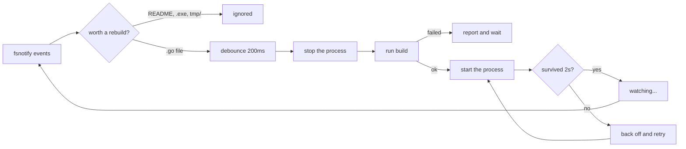

<div align="center">

# ⚡ hotreload

### Save the file. The server's already restarted.

A tiny, zero-ceremony hot reload tool for Go — watches your project, rebuilds it, and swaps the running process out from under you. No plugins, no daemon, no config sprawl.

[](https://github.com/SakthiQ/hotreload/actions/workflows/ci.yml)


</div>

---

## The 30-second version

```bash
hotreload init      # writes .hotreload.toml
hotreload           # that's the whole workflow
```

```text
INFO hotreload starting version=v1.0.0
INFO loaded config path=.hotreload.toml
INFO discovering directories to watch... root=.
INFO starting build...
INFO build successful duration=412ms
INFO starting process...
listening on :8080

  ── you edit handler.go and hit save ──

INFO file changed file=api/handler.go op=WRITE
INFO file change detected, restarting...
INFO stopping process...
INFO build successful duration=380ms
INFO starting process...
listening on :8080
```

No flags to remember. No terminal to switch to. No stale binary.

---

## Why another one?

Because the alternatives ask you to install a framework to solve a loop that's four steps long. This one is **~700 lines of Go and a single dependency** (`fsnotify`). You can read the whole thing in a lunch break — and when it misbehaves, you can actually go find out why.

| | hotreload |
|---|---|
| **Dependencies** | One. `fsnotify`. That's the list. |
| **Setup** | A config file you can hold in your head, or three flags |
| **Crash loops** | Detected and backed off, not spammed at you |
| **Windows** | A first-class target, not a footnote |
| **Noise** | Rebuilds on `.go` files — not on your README |

---

## Install

<details open>
<summary><b>From source</b> (any platform with Go)</summary>

```bash
git clone https://github.com/SakthiQ/hotreload.git
cd hotreload/hotreload
go build -o hotreload .
```

Drop the binary somewhere on your `PATH` and you're done.

</details>

<details>
<summary><b>With make</b></summary>

```bash
cd hotreload
make build     # builds with version info baked in
make check     # go vet + go test ./...
make demo      # runs the tool against the bundled test server
```

</details>

---

## Configure it once

`hotreload init` drops a `.hotreload.toml` in your project with every setting documented inline. The short version:

```toml
root  = "."                        # what to watch
build = "go build -o ./tmp/app ."  # how to build it
exec  = "./tmp/app"                # how to run it
```

Three lines and you never think about it again. Everything else has a sensible default:

<details>
<summary><b>The full reference</b> — every knob, and why it exists</summary>

```toml
# Directories to skip, relative to root. Hidden directories and the usual
# build-output directories (node_modules, vendor, tmp, dist, build, bin)
# are always skipped, so you rarely need this.
exclude = ["testdata", "docs"]

# Extensions that trigger a rebuild. Editing a README shouldn't bounce
# your server. Use ["*"] if you disagree.
include_ext = ["go", "mod", "sum"]

# Save-heavy editors fire a burst of events. This collapses them into
# one rebuild.
debounce = "200ms"

# How long a process gets to shut down before it gets killed properly.
kill_timeout = "5s"

# Pause after exit so the OS releases the listen socket — this is the
# fix for "address already in use" on fast restarts.
settle_delay = "500ms"

# debug, info, warn, error. Use debug to see exactly which files are
# being watched and which changes are being ignored.
log_level = "info"
```

Durations take Go duration strings (`"200ms"`, `"2s"`); a bare number means milliseconds. Lists take an array or a comma-separated string. **Unknown keys are errors** — a typo tells you, instead of silently doing nothing.

</details>

Prefer flags? Every setting has one, and flags always win over the file:

```bash
hotreload --root ./api --build "go build -o server ." --exec "./server" --log-level debug
```

<details>
<summary><b>All flags</b></summary>

```text
--config <path>       config file to read (default .hotreload.toml if present)
--root <path>         project root directory to watch          (required)
--build <command>     build command to run on changes          (required)
--exec <command>      command used to launch the built binary  (required)
--exclude <dirs>      comma-separated relative paths to ignore
--include-ext <exts>  extensions that trigger a rebuild, or "*" for all
--debounce <dur>      quiet period before rebuilding                 (200ms)
--kill-timeout <dur>  wait before force-killing the process             (5s)
--settle-delay <dur>  pause after exit so the OS frees the port      (500ms)
--log-level <level>   debug, info, warn or error                      (info)
--version             print the version and exit
```

Settings resolve as **defaults → config file → flags**. A flag you pass always wins; a flag you omit never quietly clobbers your config.

</details>

---

## The part everyone gets wrong

**Your server crashes on startup. What should a reload tool do?**

Most of them restart it. Instantly. Forever. Your terminal fills with the same panic 200 times a second while you're trying to read the first one.

hotreload watches how long the process survived. Under two seconds isn't a run — it's a crash. So it backs off:

```text
WARN process crashed on startup, retrying attempt=1 retry_in=1s
WARN process crashed on startup, retrying attempt=2 retry_in=2s
WARN process crashed on startup, retrying attempt=3 retry_in=4s
WARN process crashed on startup, retrying attempt=4 retry_in=8s
ERROR process keeps crashing on startup, giving up until the next file change
```

Then it stops and waits — because the next thing that will fix it is you, editing a file. The moment you save, the counter resets and it tries again.

**Your stack trace stays on screen. Your fan stays off.**

---

## How it works



Five small packages, one event loop, no magic:

| Package | Job |
|---|---|
| `internal/watcher` | Recursive watching, debouncing, exclude/extension rules |
| `internal/builder` | Runs your build, cancels it when a newer change arrives |
| `internal/runner` | Starts, stops, and force-kills the child; reports crashes |
| `internal/config` | Config file parsing and the defaults |
| `internal/app` | The loop that ties them together |

<details>
<summary><b>Why the platform-specific code exists</b></summary>

**Unix** — the child runs under `sh -c` in its own process group, so killing it takes the whole tree with it. Nothing gets orphaned holding your port.

**Windows** — the exec command is split and run **directly**, bypassing `cmd.exe`. Go through the shell and `cmd.Wait()` returns when the wrapper exits, not when your server does — so the tool thinks it's dead while it's still sitting on port 8080. Splitting the command means quoting matters, so it's quote-aware: `--exec './server --config "my dir/c.json"'` does what you'd expect, and backslashes stay literal because they're path separators, not escapes.

Shutdown is `taskkill /T /F` on the whole tree, with Go's `TerminateProcess` as the backstop for anything stubborn.

</details>

---

## Gotchas worth 20 seconds

> **`--build` and `--exec` run from `--root`**, not from where you launched the tool. Paths in them are relative to your project root.

> **Only `.go`, `go.mod` and `go.sum` trigger rebuilds by default.** Serving templates or embedding assets? Add them: `include_ext = ["go", "html", "tmpl"]`.

> **Build output must live somewhere ignored** (`tmp/` is ignored out of the box), or your build triggers the rebuild that triggers your build.

---

## Contributing

```bash
cd hotreload
go test ./...
```

The suite covers exclude and extension filtering, debounce coalescing, config parsing and validation, quote-aware command splitting, build failure and cancellation, and crash-vs-deliberate-stop detection. CI runs `gofmt`, `go vet` and `go test -race` on Linux, Windows and macOS — if it's green there, send the PR.

Full technical reference: **[hotreload/README.md](hotreload/README.md)**

---

<div align="center">

**Status:** young but honest. The core loop works, the edges are still being sanded.
Found a rough one? [Open an issue](https://github.com/SakthiQ/hotreload/issues) — small project, fast replies.

Built from scratch. No `air`, no `realize`, no `reflex` — just `fsnotify` and the standard library.

</div>
